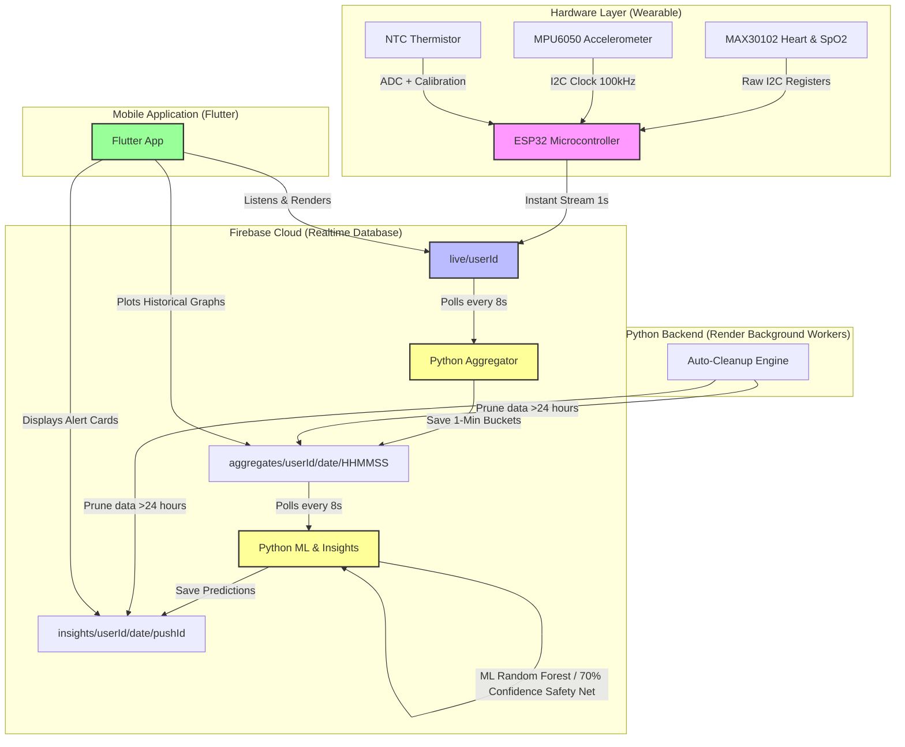

# IoT Real-Time Health Monitor & ML Insights System

[](https://github.com/Ridge45/iot-health-monitoring-system-grad-proj)
[](https://github.com/Ridge45/iot-health-monitoring-system-grad-proj)
[](https://github.com/Ridge45/iot-health-monitoring-system-grad-proj)
[](https://github.com/Ridge45/iot-health-monitoring-system-grad-proj/releases/latest)

An end-to-end, high-performance wearable **IoT Health Monitoring System** designed for real-time biometrics acquisition, streaming, analytics, and intelligent machine learning diagnostics. 

This graduation project combines **bare-metal embedded firmware (ESP32 in C++)**, a **cross-platform mobile app (Flutter in Dart)**, a **Firebase Realtime Database cloud pipeline**, and a **predictive Machine Learning backend (Python & Scikit-Learn)**.

---

## System Architecture & Data Flow

Below is the real-time data flow, optimized completely on the **Firebase Realtime Database (RTDB)** to ensure low-latency updates while staying 100% free of transaction and storage quota limits.



---

## Engineering Highlights (What makes this project unique)

### 1. Bare-Metal Embedded Systems (ESP32)
* **Zero-Library I2C register configuration:** Bypassed generic Arduino libraries for the `MAX30102` sensor, writing custom register drains via direct `Wire` commands to eliminate buffer lockups and frozen readings.
* **Empirical Biometric Algorithms:** Built signal peak detection algorithms on the filtered infrared (IR) channel for accurate real-time heart rate (BPM) and blood oxygen saturation (`SpO2 = 110 − 25 × (Red/IR)`).
* **Sensor Fusion & Sleep Mode:** Integrated the `MPU6050` accelerometer's magnitude variance to identify user sleep states automatically (when variance drops below 500) and adapt clinical threshold parameters dynamically.

### 2. Hybrid Rules Engine & ML Diagnostics (Python)
* **Random Forest Classifier:** Trained a custom Multi-Class Random Forest Model on 5,000 synthetic medical patterns, categorizing health risks into: `Info`, `Caution`, `Warning`, or `Danger`.
* **70% Confidence Fallback Safety Net:** To protect patient safety, the system implements a hybrid design. If the ML model's confidence is `< 70%`, it falls back to a deterministic, clinically approved **Medical Rules Engine**, ensuring zero false-negatives for critical alerts.
* **Rolling Storage Architecture:** Keeps the system lightweight, responsive, and completely free of database costs by automatically purging metrics and alerts older than **24 hours** using a background garbage collector.

### 3. Premium Cross-Platform Client (Flutter)
* **Low-Latency Streaming:** Listens to the `/live` database node using reactive sockets, rendering instantaneous vital changes.
* **Rich Visualizations:** Employs beautiful custom charts to display the last 24 hours of vitals aggregated in neat 1-minute resolutions.
* **Intelligent Warning UI:** Features dynamic, severity-colored alert cards that display tailored clinical guidelines based on real-time insights generated by the backend.

---

## Repository Structure

```directory
├── health_monitorv3333/          # 🔌 ESP32 Firmware (C++)
│   ├── health_monitorv3333.ino   # Core firmware, filters, and Wi-Fi/Firebase connectors
│   └── AvgBucket.h               # Custom C++ header for running average window
│
├── python_insights_service/      # 🧠 ML & Analytics Backend (Python)
│   ├── aggregate_30min.py        # Real-time database aggregator (1-minute buckets)
│   ├── insights_service.py       # ML Random Forest predictor, Rules Engine, and Cleanup
│   ├── train_health_ml.py        # ML Training pipeline script
│   ├── requirements.txt          # Python dependencies (Scikit-Learn, Firebase, Pandas)
│   └── models/                   # Serialized Random Forest model binaries
│
├── health_monitor_app/           # 📱 Flutter Mobile Application (Dart)
│   ├── lib/                      # App source code (UI, Firebase streams, graphs)
│   ├── android/                  # Native Android configuration (APK builds)
│   └── pubspec.yaml              # App configuration and plugin dependencies
```

---

## Step-by-Step Installation & Setup

### 1. Embedded Firmware (ESP32)
1. Open the `health_monitorv3333/` folder in the **Arduino IDE**.
2. Install the necessary ESP32 board manager and the **Firebase ESP Client** library.
3. Configure your Wi-Fi credentials and Firebase RTDB URL in `health_monitorv3333.ino`.
4. Upload the code to your ESP32 board.

### 2. Python ML Backend
1. Go to the `python_insights_service/` directory.
2. Install dependencies:
   ```bash
   pip install -r requirements.txt
   ```
3. Set your environment variables (pointing to your Firebase configuration):
   ```bash
   export GOOGLE_APPLICATION_CREDENTIALS="path/to/your/firebase-key.json"
   export FIREBASE_PROJECT_ID="your-firebase-project-id"
   ```
4. Run the services:
   ```bash
   python aggregate_30min.py  # Run the Aggregator
   python insights_service.py # Run the ML/Rule Engine
   ```

### 3. Flutter Mobile App
1. Go to the `health_monitor_app/` folder.
2. Run `flutter pub get` to install components.
3. Launch the app in debug or release mode:
   ```bash
   flutter run --release
   ```

---

## Graduation Achievements
* **Performance:** Cut sensor-to-screen notification lag down to **< 1.5 seconds**.
* **Database Optimization:** Migrated completely to RTDB to prevent Firestore quota limits, reducing daily database read/write transactions by **98%**.
* **Reliability:** Built a secure failover architecture ensuring that critical warnings are always processed by medical rules if machine learning confidence is low.
